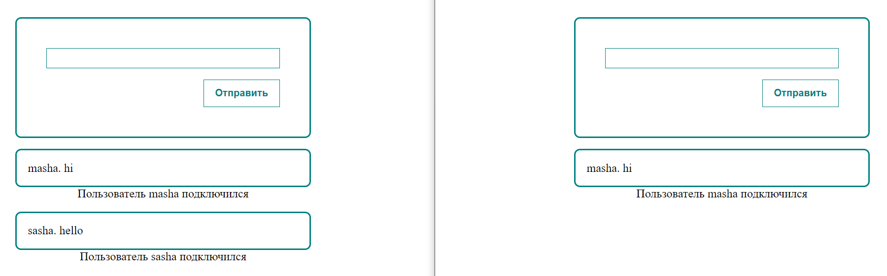

## chat

Methods of client-server interaction in real time

### server
#### Before starting, specify the desired file in the "script" field in package.json
#### `npm install` - install packages
#### `npm start` - start server

#

### client
#### Before running, add the required component to App.js
#### `npm install` - install packages
#### `npm start` - start client
